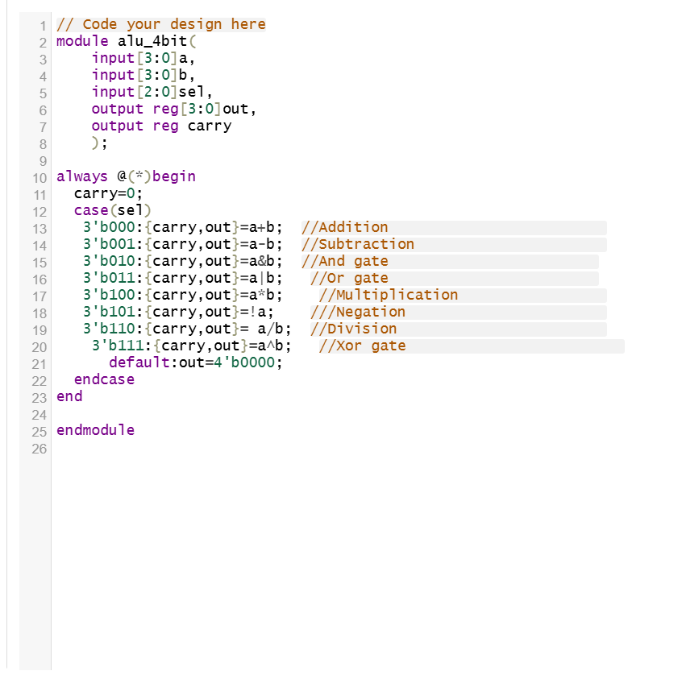
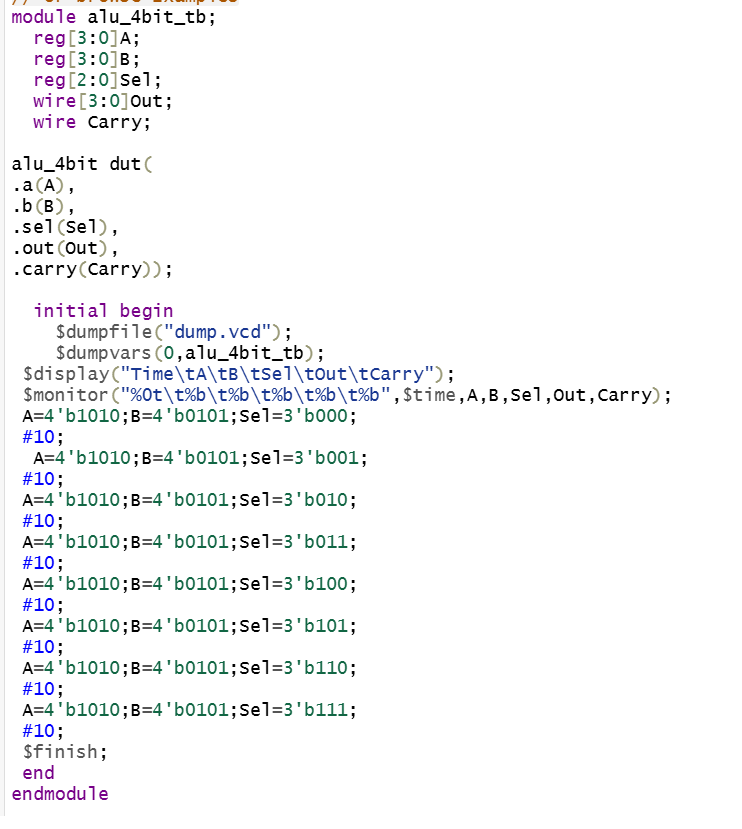
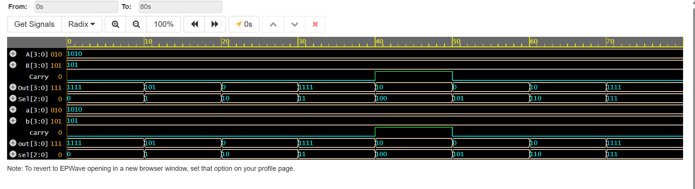
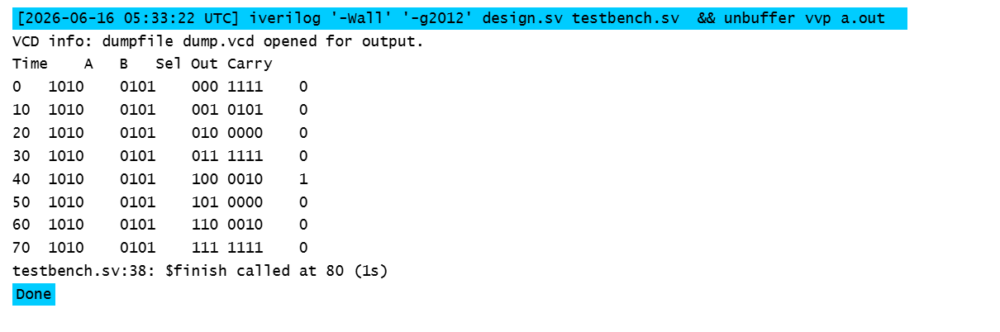

# Design and Verification of a 4-Bit Arithmetic Logic Unit (ALU) Using Verilog HDL

## 📌  Project Overview
The 4-Bit Arithmetic Logic Unit (ALU) is a digital circuit designed using Verilog HDL to perform both arithmetic and logical operations on 4-bit binary inputs. The ALU takes two 4-bit operands (A and B) and a 3-bit selection signal (Sel) to execute operations such as addition, subtraction, AND, OR, multiplication, negation, division, and modulus. The design was simulated and verified using Icarus Verilog and EPWave, and the results confirmed the correct functionality of all operations. This project demonstrates the fundamentals of digital circuit design and hardware implementation used in processors and embedded systems.

## 📌 Features
    
| Selection Input | Operation           |
| --------------- | ------------------- |
| 000             | Addition            |
| 001             | Subtraction         |
| 010             | Bitwise AND         |
| 011             | Bitwise OR          |
| 100             | Multiplication      |
| 101             | Negation            |
| 110             | Division            |
| 111             | Bitwise Xor         |

## 📌  Tools Used
1.Verilog Hdl
2.EDA Playground
3.Behavioral Simulation

## 📂 Project Files
alu_4bit.v.txt → ALU Design Module
alu_4bit_tb.v.txt → Testbench for Verification

## 🧪 Verification
Test Inputs
A = 1010
B = 0101

Simulation Results
| Operation      | Result        |
| -------------- | ------------- |
| Addition       | 1111          |
| Subtraction    | 0101          |
| AND            | 0000          |
| OR             | 1111          |
| Multiplication | 0010, Carry=1 |
| Negation       | 0000          |
| Division       | 0010          |
| XOR            | 1111          |

## 📸 Screenshots

### RTL Design

### Testbench

### Simulation Waveform

### output

## 🎯 Learning Outcomes
Through this project, I gained hands-on experience in:

1.Verilog HDL Coding
2.Combinational Logic Design
3.RTL Development
4.Testbench Writing
5.Functional Verification
6.Simulation and Debugging
7.Vivado Design Flow

## Applications
-Microprocessors and CPUs
-Embedded Systems
-FPGA-Based Designs
-Digital Signal Processing Systems
-Arithmetic Processing Units
-Educational VLSI Projects
-ASIC Design Prototyping
